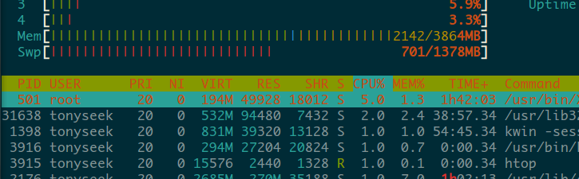
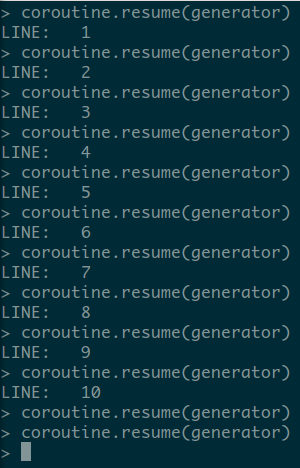

用协程做奇怪的事情
==================

“二十一天精通” 系列（ 预计耗时 **40min** ）

主题内容
--------

* 协程介绍

  * Lua 中的协程
  * 世界人民的实现

* 状态转移

  * 状态机的表达
  * 词法分析

* 异步编程

  * 老赵的 Wind.js
  * Greenlet/Gevent

协程介绍
--------

进程和线程
~~~~~~~~~~

进程
    占有操作系统 **资源** 的单元，一个运行的操作系统至少包含一个进程

线程
    占有处理机 **时间片** 的单元，一个运行的进程至少包含一个线程

无论是进程还是线程，系统内核都知道它们的存在

对比协程
~~~~~~~~

协程仅仅是 **用户空间** 的一种调度实现

与进程&线程的不同之处
^^^^^^^^^^^^^^^^^^^^^

#. 操作系统内核不知道协程的存在

#. 协程不独享进程控制块和处理机时间片

与进程&线程的相同之处
^^^^^^^^^^^^^^^^^^^^^

#. 协程的状态存在挂起、唤醒、死亡

#. 协程和协程之前有控制权的释放和获取

非抢占 —— “协同式调度”
~~~~~~~~~~~~~~~~~~~~~~

所以不存在临界资源的安全问题

所以不存在复杂的调度管理问题

~~~~~~~~~~~~~~~~~~~~~~~~~~~~~~~~~

Lua 中的协程
~~~~~~~~~~~~

.. code-block:: lua

    #!/usr/bin/env lua5.2
    local generator;
    generator = coroutine.create(function ()
      for i=1,10 do
        print("LINE: ", i)
        coroutine.yield()
      end
    end)

.. code-block:: lua

    coroutine.resume(generator)
    coroutine.yield()

Lua 中的协程：DEMO
~~~~~~~~~~~~~~~~~~

线性的执行过程可被挂起

世界人民的实现：Python —— 生成器
~~~~~~~~~~~~~~~~~~~~~~~~~~~~~~~~

.. code-block:: python

    def get_roles():
        yield "everyone"
        for role in user.roles:
            if role.is_enabled():
                yield role
        yield "#"

更多被用于“迭代器”

yield 执行时当前协程挂起

next() 唤醒挂起的协程继续执行到下一个挂起点

局限：挂起点是静态定义在函数代码中的

世界人民的实现：Python —— Greenlet
~~~~~~~~~~~~~~~~~~~~~~~~~~~~~~~~~~

.. code-block:: python

    from time import sleep
    from greenlet import greenlet

    @greenlet
    def ping():
        while True:
            print("ping")
            sleep(1)
            pong.switch()

    @greenlet
    def pong():
        while True:
            print("pong")
            sleep(1)
            ping.switch()

    if __name__ == "__main__":
        ping.switch()

其他国家人民
~~~~~~~~~~~~

* Ruby & C#: Fiber (微线程、纤程)
* Erlang: Green Process
* Go: Goroutine
* Scala: Actor

表达状态转移
------------

状态机
~~~~~~

一个协程的挂起 + 另一个协程的唤醒 = 控制权转交

所以用协程可以非常简洁地表达有限状态自动机

（C 语言的 GOTO 也可以）

词法分析 (1)
~~~~~~~~~~~~

.. code-block:: lua

    -- 代码摘抄自：
    -- http://ravenw.com/blog/2011/09/01/coroutine-part-2-the-use-of-coroutines

    -- matching a string literal
    function prim(str)
        return function(S, pos)
            local len = string.len(str)
            if string.sub(S, pos, pos+len-1) == str then
                coroutine.yield(pos + len)
            end
        end
    end

    -- alternative patterns (disjunction)
    function alt(patt1, patt2)
        return function(S, pos)
            patt1(S, pos)
            patt2(S, pos)
        end
    end

词法分析 (2)
~~~~~~~~~~~~

.. code-block:: lua

    function match(S, patt)
        local len = string.len(S)
        local m = coroutine.wrap(function() patt(S, 1) end)
        for pos in m do
            if pos == len+1 then
                return true
            end
        end
        return false
    end

.. code-block:: lua

    local patt;

    -- 等同于正则表达式: (abc)|(de)
    patt = alt(prim("abc"), prim("de"))

    match("abc", patt) -- output: true
    match("de", patt) -- output: true
    match("abcde", patt) -- output: false

遍历子树
~~~~~~~~

.. code-block:: guess

    #!/usr/bin/env python3.3

    class TreeNode(object):
        """A tree struct."""

        def __init__(self, name, parents=[]):
            self.name = name
            self.parents = frozenset(parents)

        def __repr__(self):
            return "<Node %s>" % self.name

        def get_all_parents(self):
            for parent in self.parents:
                yield parent
                yield from parent.get_all_parents()

异步编程
--------

回调导致支离破碎的控制流
~~~~~~~~~~~~~~~~~~~~~~~~

.. code-block:: javascript

    var check_conflict = function(callback) {
        var url = "/j/chk-conflict?start=" + start + "&end=" + end;
        $.get(url, function(response) {
            if (response.number_of_items > 0) {
                if (!confirm(response.prompt_text)) {
                    return;
                }
            }
            if (typeof callback !== "undefined") {
                callback();
            }
        });
    };

    var confirm_days = function(callback) {
        // ...
        $.get(url, function(response) {
            // ...
            callback();
        })
    };

回调导致支离破碎的控制流
~~~~~~~~~~~~~~~~~~~~~~~~

.. code-block:: javascript

    check_conflict(function() {
        confirm_days(function() {
            $("#my-form").submit();
        });
    });

如果这个过程在非异步模式下，只需要：

.. code-block:: javascript

    if (check_conflict() && confirm_days()) {
        $("#my-form").submit();
    }

老赵的 Wind.js
~~~~~~~~~~~~~~

.. code-block:: javascript

    var submit = eval(Wind.compile("async", function () {
        if ($await(check_conflict()) && $await(confirm_days())) {
            $("#my-form").submit();
        }
    }));

Greenlet/Gevent
~~~~~~~~~~~~~~~

Greenlet 提供协程支持

结合 libevent/libev 获取事件

当 TCP 连接等待时，不阻塞线程，而是挂起当前协程

连接就绪事件触发时，唤醒对应的协程继续执行

基于协程的好处
~~~~~~~~~~~~~~

不需要内核来调度, 完全基于事件

高并发下无压力，因为和回调的执行方式等价

无抢占，协程永远“安全”

* N 个 CPU 开启 N 个进程
* M 个连接开启 M 个协程
* M 平均地分布到 N 中

适合 IO 密集型应用

QA
==
